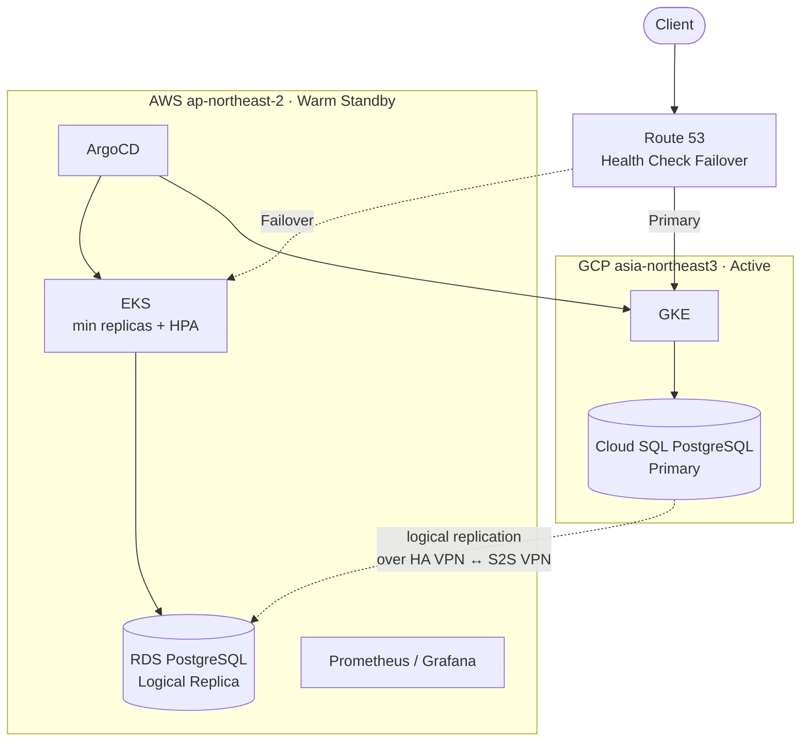

# PayFlow Multi-Cloud DR

GCP(Primary) + AWS(Warm Standby) 멀티클라우드 재해복구 PoC.
가상 결제 플랫폼 **PayFlow**를 대상으로, 단일 CSP 전체 장애 시 AWS로 서비스를 절체하고 RTO/RPO를 실측한다.

## 왜 멀티리전이 아니라 멀티클라우드인가

| 근거 | 내용 |
|---|---|
| 국내 리전 제약 | 국내 데이터 보관을 전제로 하면 GCP는 한국 리전이 서울 1개라 국내 리전 이중화가 불가능하다 |
| 멀티리전으로 못 막는 장애 | CSP 전체의 컨트롤 플레인·IAM 장애, 계정 정지 (예: 2025-06 GCP Service Control 장애, 2025-10 AWS us-east-1 장애) |
| 규제 대응 관점 | 규제가 멀티클라우드를 의무화하지는 않는다. 다만 DORA 등이 요구하는 **CSP 집중 리스크 관리·Exit Strategy**를 실제로 실행할 수 있는지 검증한다 |
| 트레이드오프 인정 | 대부분의 서비스에는 멀티리전이 맞다. 이 프로젝트는 복잡도와 egress 비용을 감수하고 위 리스크만을 겨냥한다 |

자세한 의사결정 기록: [docs/decisions/0001-multicloud-dr.md](docs/decisions/0001-multicloud-dr.md)

## 아키텍처 요약



- ArgoCD와 관제 스택은 **AWS 쪽에 둔다**. Primary(GCP)가 죽어도 배포와 관제는 살아 있어야 하기 때문이다.
- DB 승격 전 GCP 쓰기를 차단(fencing)해 split-brain을 막는다. → [docs/runbook/failover.md](docs/runbook/failover.md)

상세 설계: [docs/architecture.md](docs/architecture.md)

## 목표 지표

| 지표 | 목표 | 비고 |
|---|---|---|
| RTO | ≤ 5분 (측정 후 확정) | 감지 → DNS 전환 → DB 승격 → 정상 응답, 단계별 실측 |
| RPO | ≤ 수 초 (측정 후 확정) | 평시 복제 지연(replication lag)으로 측정 |
| DR 유지 비용 | 실측 | 평시 AWS 비용 vs 가상 장애 손실액 비교 |

> 수치는 리허설 실측값으로 갱신한다. 측정 전 숫자를 결론으로 쓰지 않는다.

## 디렉토리 구조

```
.
├── infra/                 # Terraform
│   ├── gcp/               #   VPC, GKE, Cloud SQL, HA VPN
│   ├── aws/               #   VPC, EKS, RDS, S2S VPN, Route 53
│   └── modules/           #   공통 모듈
├── apps/                  # 결제 MSA (auth / payment / order)
├── deploy/
│   ├── base/              # 클라우드 공통 매니페스트 (Kustomize base)
│   ├── overlays/gke/      # GKE 전용 차이 (Ingress, StorageClass, replicas)
│   ├── overlays/eks/      # EKS 전용 차이 (ALB Ingress, min replicas)
│   └── argocd/            # ArgoCD Application / 클러스터 등록
├── observability/         # Prometheus, Grafana 대시보드, Blackbox, 알림
├── chaos/                 # 장애 주입 시나리오 및 스크립트
├── scripts/               # 절체·승격·정합성 검증·비용 절감 스크립트
├── docs/
│   ├── architecture.md    # 상세 설계
│   ├── decisions/         # ADR (의사결정 기록)
│   └── runbook/           # Failover / Failback 절차
└── .github/workflows/     # CI (이미지 빌드 → Artifact Registry + ECR)
```

## 역할 분담

| 담당 | 트랙 | 주요 디렉토리 |
|---|---|---|
| A | 인프라 / 네트워크 | `infra/` |
| B | 데이터 복제 / DB 승격·Failback | `scripts/`, `docs/runbook/` |
| C | 앱 / CI·CD / GitOps | `apps/`, `deploy/`, `.github/` |
| D | 관제 / 장애 훈련 / 발표 | `observability/`, `chaos/` |

## 일정 (22일)

| 기간 | 목표 | 완료 조건 |
|---|---|---|
| D1–2 | 설계 확정 | 아키텍처, RTO/RPO 목표, 장애 시나리오 3개 확정 |
| D3–8 | 기반 구축 | `terraform apply`로 양쪽 클러스터 + VPN 생성, GKE에서 앱 동작 |
| **D8** | **점검** | 4인 통합 확인, 막힌 트랙 범위 조정 |
| D9–14 | 연결 | GCP→AWS 복제 지연 측정, 커밋 하나로 GKE·EKS 동시 배포, 통합 대시보드 |
| **D14** | **점검** | 4인 통합 확인, 막힌 트랙 범위 조정 |
| D15–18 | 통합 · 장애 훈련 | 절체 리허설 최소 3회, 단계별 소요 시간 실측 |
| D19–20 | 보강 | 리허설 이슈 수정, 비용 분석 |
| D21–22 | 발표 | 슬라이드, 데모 녹화본(라이브 실패 대비), 예상 질문 정리 |

## 비용 관리

- 첫날 GCP·AWS 양쪽에 **예산 알림** 설정
- 야간에는 **노드풀만 0으로 축소**하고 DB는 유지한다 (DB를 지우면 복제를 처음부터 다시 맞춰야 한다)
- NAT·VPN은 상시 과금되므로 매주 크레딧 소진 속도를 확인한다
- 실제 카드번호 등 실 결제 데이터는 사용하지 않는다 (더미 데이터만)
